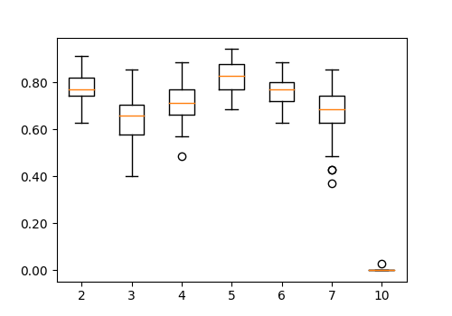

# Supplementary Material For the Paper "NUTS, NARS, and Speech"

NUTS: raNdom dimensionality redUction non axiomaTic reasoning few Shot learner for perception https://link.springer.com/chapter/10.1007/978-3-031-33469-6_31

With 2 Examples per class, we achive 64% accuracy, at 20 examples per class we archive 90% accuracy (embedding space dimensions = 5). 

This is archived with a low dimensional embedding space (5 dimensions), which reduces compute (examples per class = 4).

Confusion matrix (embedding space dimensions = 5, examples per class = 4)

# Reproduction

## 1 Clone NUTS

cd ~/projects
git clone https://github.com/dwanev/NUTS 

## 2 Install ONA (Open NARS for applications)

 - NUTS uses open NARS for applications (ONA). Which  can be found here: https://github.com/opennars/OpenNARS-for-Applications. ONA is installations instructions can be found on the webpage above, but in brief:

cd ~/projects
git clone https://github.com/opennars/OpenNARS-for-Applications  
cd OpenNARS-for-Applications  
./build.sh  

 - Set up an environment variable so the NUTS can find ONE

export ONA_PATH_TO_NAR=~/projects/OpenNARS-for-Applications 

## 3 Create a virtual environment 

conda create -n nuts python=3.9
conda activate nuts

## 4 Install dependencies 

cd ~/projects/NUTS
conda activate nuts  
pip install -r requirements.txt

## 5 Reproduce experiments 

python3 main_confusion_matrix_performance.py  
python3 main_experiment_vary_AIKR_limit.py  
python3 main_experiment_vary_dimensions.py  
python3 main_experiment_vary_examples_per_class.py 

# Misc

### To start NARs (Just FYI)

cd projects/OpenNARS-for-Applications  
conda activate open_nars  
./NAR shell  

# Citation

If you find this useful please cite:

@InProceedings{10.1007/978-3-031-33469-6_31,  
author="van der Sluis, Dwane",  
editor="Hammer, Patrick  
and Alirezaie, Marjan  
and Stranneg{\aa}rd, Claes",  
title="NUTS, NARS, and Speech",  
booktitle="Artificial General Intelligence",  
year="2023",  
publisher="Springer Nature Switzerland",  
address="Cham",  
pages="307--316",  
abstract="To investigate whether ``Intelligence is the capacity of an information-processing system to adapt to its environment while operating with insufficient knowledge and resources`` [29], we look at utilising the non axiomatic reasoning system (NARS) for speech recognition. This article presents NUTS: raNdom dimensionality redUction non axiomaTic reasoning few Shot learner for perception. NUTS consists of naive dimensionaility reduction, some pre-processing, and then non axiomatic reasoning (NARS). With only 2 training examples NUTS performs similarly to the Whisper Tiny model for discrete word identification.",  
isbn="978-3-031-33469-6"  
}

DOI https://doi.org/10.1007/978-3-031-33469-6_31

